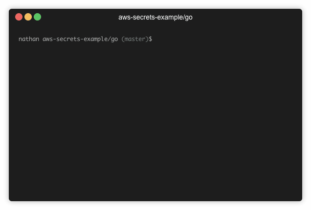

# AWS Secrets Go Example

This example shows how an application could access secrets from AWS parameter store in Go. It assumes the following:

- There is an encrypted secret already located at `/app/some-secret`
- The secret is encrypted with the default SSM KMS key
- The secret is in the same AWS region as this app is being run against

## Quick Start

Run the following to see the example in action:

```sh
go mod vendor  # grab dependencies for this example
go run -mod=vendor *.go
```

Your secret should print on the screen at one second intervals. It will remain
cached for 10 second periods (in production you'd be better using a larger
value). Change the secret while the application is running, and you'll see the
secret change when the app refreshes its cached value.

## Demo

This demo shows what happens when I've pre-populated the secret in my AWS
account, and run the Go application. The value is cached for 10 seconds, and
then refreshed. The value was changed in SSM during the demo, and you can see
this reflected in the application output


